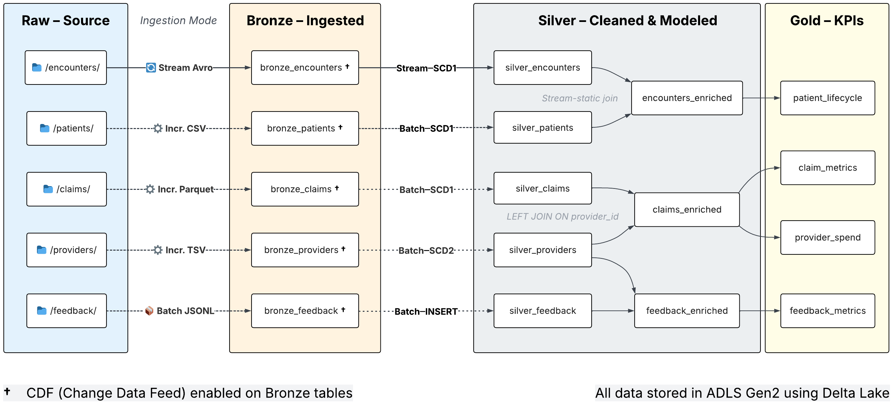

<h1 align="center">Kardiaflow: Azure Databricks Healthcare Lakehouse</h1>

  Turn raw healthcare records into protected, analytics-ready data — with streaming, PHI masking, and CDC.

  

---

<h3 align="center" style="font-size:1.4em;">▷ See It in Action (2-min demo)</h3>

  

---

## Key Features

| Capability | What you get                                             |
|---|----------------------------------------------------------|
| **Streaming & batch** | Auto Loader for streams, COPY INTO for bulk |
| **Privacy & CDC** (PHI mask, de-dup, SCD1/2) | History-aware Silver via Delta MERGE/CDF               |
| **Gold analytics** | KPIs for Databricks SQL (lifecycle, spend, sentiment) |
| **Quality & CI** | Smoke checks → Delta audit table; unit tests via GitHub Actions |
| **IaC & cost** | Bicep deploy/teardown, secrets in scopes, single-node friendly |

---

## Pipeline Architecture

Raw patient, encounter, claims, provider, and feedback data land in **Bronze** ➜ **Silver** applies PHI masking and CDC ➜ **Gold** aggregates metrics for analytics.

---

## Run It Yourself on Azure

Kardiaflow is fully reproducible on Azure with **Bicep + CLI scripts**. In ~5–10 minutes you’ll have a Databricks workspace, ADLS Gen2, and a service principal. A teardown script is included to avoid lingering costs.

**Prereqs:** Azure subscription, Azure CLI, Databricks CLI, Databricks PAT.

1) **Configure** — copy `.env.example` → `.env` and fill in SUB/RG/etc.  
2) **Deploy** — create RG and deploy Databricks + ADLS with Bicep (see `infra/README.md`).  
3) **Set up Databricks** — authenticate CLI, create a Service Principal, publish the `kflow` wheel.  
4) **Run & clean up** — bootstrap sample data, import the “full run” job, **Run now**, then tear down to avoid cost.

🔗 Full guide: [infra/README.md](infra/README.md)  
> **Note:** Runs on a single-node Databricks cluster for just a few dollars.

---

## Codebase Overview

- **[notebooks/](notebooks/)** — end-to-end workflows across Bronze, Silver, and Gold layers.

  • Bronze example: [`bronze_patients_autoloader.ipynb`](notebooks/00_bronze/encounters/bronze_patients_autoloader.ipynb)  
  • Silver example: [`silver_patients_scd1_batch.ipynb`](notebooks/01_silver/encounters/silver_patients_scd1_batch.ipynb)

- **[kflow/](kflow/)** — core library with authentication, ETL utilities, and validation helpers.

- **[pipelines/](pipelines/)** — Databricks job JSON definitions and dashboard exports.

- **[infra/](infra/)** — Bicep templates and CLI scripts for reproducible deployment (see [infra/README.md](infra/README.md)). 

- **[docs/](docs/)** — reference materials, such as the [data_dictionary.md](docs/data_dictionary.md). 

---

## Databricks Summit 2025

Reflections from Databricks Summit workshops on streaming and governance:  [docs/summit_reflections.md](docs/summit_reflections.md).