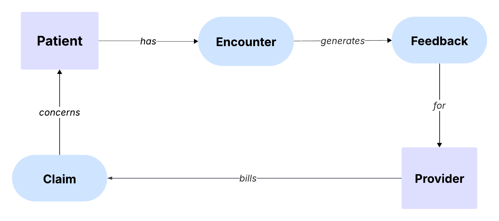
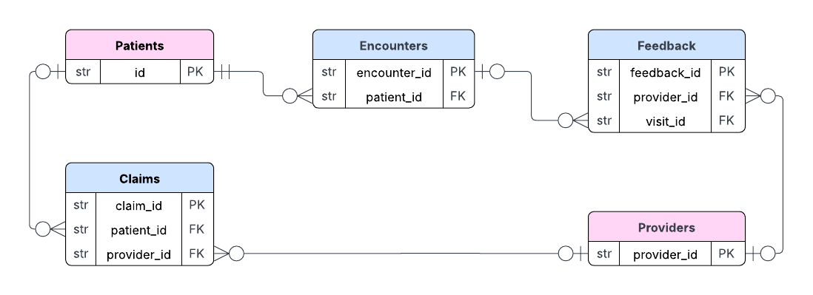

## Data Model Overview

Conceptual and physical views of entity relationships in Kardiaflow.

_Companion docs: [Data Dictionary](./data_dictionary.md) | [Naming Standards](./naming_standards.md)_

#### Conceptual Model

A broad view of the healthcare domain, where patients and providers (entities) are linked to encounters, claims, and feedback (events).



---

#### Physical Model

The Silver-layer schema, which highlights primary keys, nullable foreign keys, and cardinalities.

This perspective shows how entities are actually stored and connected within the lakehouse.



---

### Data Quality in the Raw Layer

The raw layer does not guarantee uniqueness or enforce relationships between entities. As a result, orphan records are common—for example, claims referencing patients that are missing or feedback tied to absent providers. To preserve events, all fact-to-dimension joins are left joins, ensuring the event remains even without a matching reference. Stricter checks, such as non-null enforcement and duplicate suppression, are applied in the Silver and Gold layers.

---

### How to Join the Data

Use these predicates when exploring Bronze or tracing lineage prior to normalization.

```sql
-- Join claims to patients.
-- Left join ensures all claims are kept even if the patient record is missing.
SELECT c.*,
       p.ID AS patient_pk
FROM claims c
LEFT JOIN patients p
       ON c.PatientID = p.ID;

-- Join claims to providers to enrich with provider details.
-- Provider attributes are static reference fields in the raw data.
SELECT c.*,
       pr.ProviderSpecialty,
       pr.ProviderLocation
FROM claims c
LEFT JOIN providers pr
       ON c.ProviderID = pr.ProviderID;

-- Join encounters to patients to connect each event with its patient.
-- Left join keeps encounter events even when the patient record is absent.
SELECT e.*,
       p.ID AS patient_pk
FROM encounters e
LEFT JOIN patients p
       ON e.PATIENT = p.ID;
```